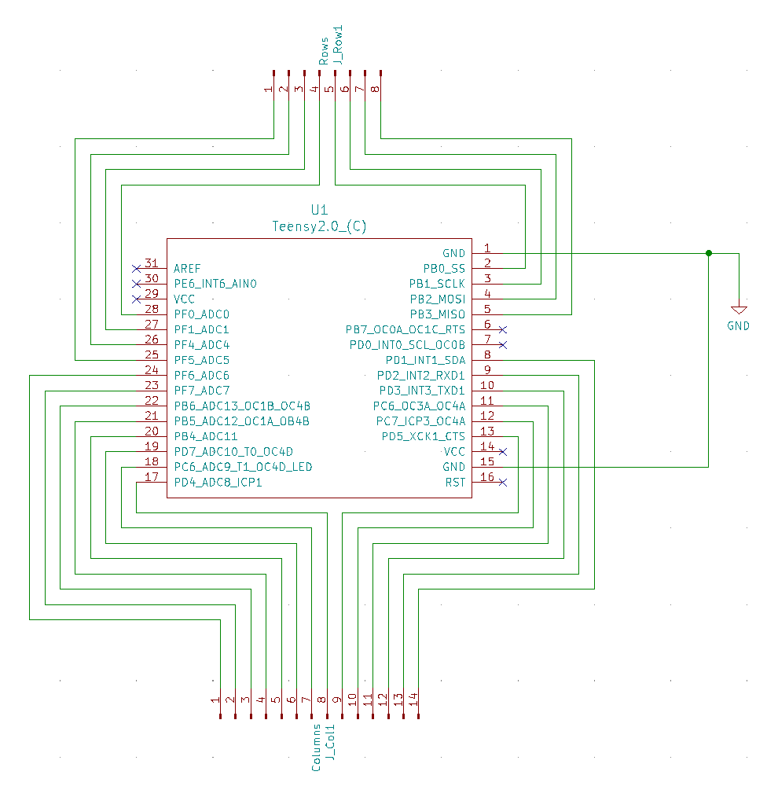
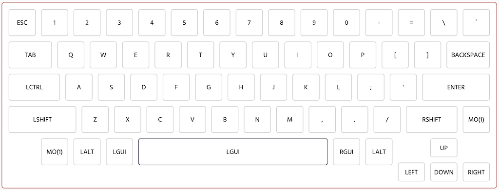

# Teensy 2.0 replacement controller board for HHKB Lite 2

This replaces the controller for the [HHKB Lite
2](https://deskthority.net/wiki/HHKB_Lite), identified by model
numbers PD-KB200W/U or PD-KB200B/U.

This Lite version of the HHKB is a membrane keyboard and not exactly
popular compared to more expensive Professional versions that use
Topre switches. But the wiring is simple and is a good first project
for modding commercial keyboards.

This replacement uses a [Teensy
2.0](https://www.pjrc.com/store/teensy.html), which is cheap, has
plenty of pins, and works well with the [QMK
firmware](https://qmk.fm/). The entire controller board is replaced,
so you will lose the built-in USB hub.

## PCB

This is a [KiCad](https://kicad-pcb.org/) project, but you can find
the generated fabrication files in `plots/`. Just send them to your
preferred PCB factory.

The schematics are fairly straightforward, with 8 row pins and 14
column pins:

The PCB layout is likewise simple:

Note that the Teensy should be mounted upside down, on the same side
as the connectors. This is to save a couple of millimeters of space
from the stacked height of the connectors.

The Mini-USB plug that goes to the Teensy needs to be shaved down too,
to save about 1mm of thickness.

## Parts

* 1 [Teensy 2.0](https://www.pjrc.com/store/teensy.html)
* 1 Molex Easy-On 14-pin 1.25mm pitch FFC connector 39-53-2145
* 1 Molex Easy-On 8-pin 1.25mm pitch FFC connector 39-53-2085
* 1/10" pitch thru-hole headers for Teensy
* (White?) Mini-USB cable for Teensy

## Firmware

The configuration in `firmware/` can be uploaded to [Keyboard Firmware
Builder](https://kbfirmware.com/) to generate the standard US QWERTY
layout.

There will be a warning "Not every key has a unique position in the
wiring matrix". This can be ignored and it is due to both `Fn` keys
being wired exactly the same. You should take note of this when
designing your own layouts: it is not possible to assign different
keycodes to each `Fn` key as they are electrically indistinguishable.

The wiring matrix is a bit of a mess, as is typical of membrane
keyboards that do not have diodes to prevent ghosting: the matrix is
designed to minimize ghosting from common key combinations but will
never completely eliminate it.

